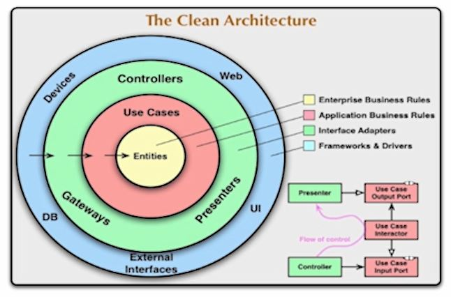

# Clean Architecture

# Modelo simplificado usado neste projeto

- Domain Services são classes que representam uma ação entre mais de uma entidade.
- Application Services controlam o fluxo de alguma regra em nossa aplicação.
- Infrastructure Services são implementações de interfaces presentes nas camadas de domínio ou de aplicação.